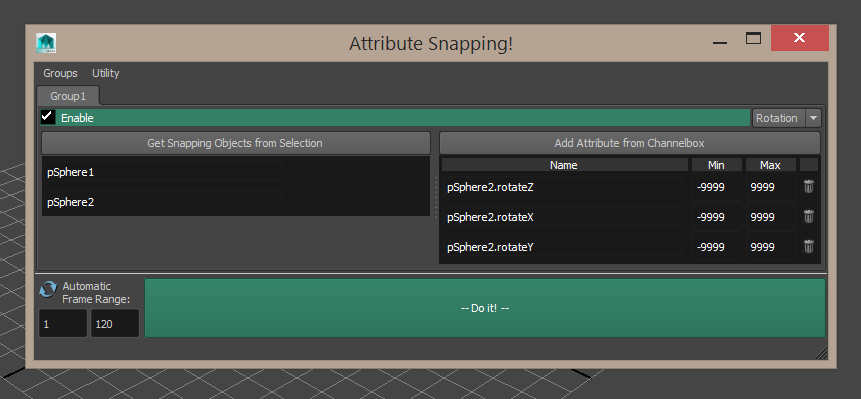

## Attribute Snap

You want to snap two things together (or align their orientation)? Constraints not doing it for you? Perhaps you need to use a controller on a different object to do the snapping, or the attributes required are not translate/rotates (ie foot rolls etc)?

This tool is the answer. It takes two objects and moves them as close as possible to each other, using attributes you define. Essentially it "eyeballs" it in an efficient way.

Drag and drop the file below into your maya viewport:

__<download>attrsnap</download>__

You will get a new shelf icon in whichever shelf is currently active.

#### Step one!

* Begin by deciding on two objects you wish to keep as close as possible to each other. If the exact position is not ideal (ie offsets) consider first constraining a locator to the object and using that for the snapping instead.

* Select both objects (locators?) and click "Get snapping objects from selection". _You can also manually type in the names if that suits_

#### Step two!

* Decide on the snapping type. Position or rotation. Position tracks the distance between objects and rotation tracks orientation. _Select your preference from the dropdown_.

> Please note: You can certainly match a rotation using positional tracking, if you imagine it like a look-at constraint. Or vice versa.

#### Step three!

* Highlight the attributes of objects you wish to use in the channelbox.
* Click the "New attribute from channelbox" button.

> Note: Think carefully about this. Are these attributes going to counter each other? Are they all needed (more attributes = more computing time)? A smart choice of attributes will produce a better, faster and more accurate match.

* Input limits in the "min" and "max" columns for the attributes. _This is useful if you wish to restrict the matching. For instance not rotating past 360 degrees._

#### Step FINAL!

* Choose your frame range. Automatic framing is on by default.

> Note: Automatic framing will adjust the frame numbers live to whatever frame you are on, __OR__ to whatever range you have highlighted in the timeline.

> Note: It's recommended that you first do a single frame match to test it out. Sometimes it does what it's supposed to, but not what you want it to do and some attribute adjustments can be fine tuned.

* __Click "Do it!" to begin snapping the objects.__

#### Extra Features!

* You can add more than one matching group at a time. When you run the tool it will automatically to every snapping group that is enabled. Disable groups to exlude them from the match, if you don't wish to delete them.
* Double click the tab button to rename the tab.
* Right click the "auto framerange" button to bring up extra options.
* The retarget tool (under utilities) will allow you to batch rename objects in the scene. Useful if you are loading in a different scene and objects have subtle name changes.
* You can export and import group settings. Great if you do matches often and wish to reload settings.
