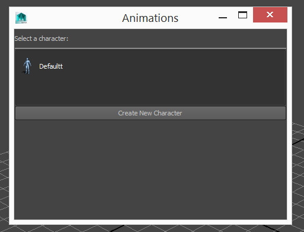
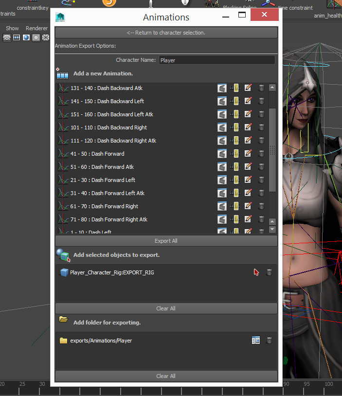
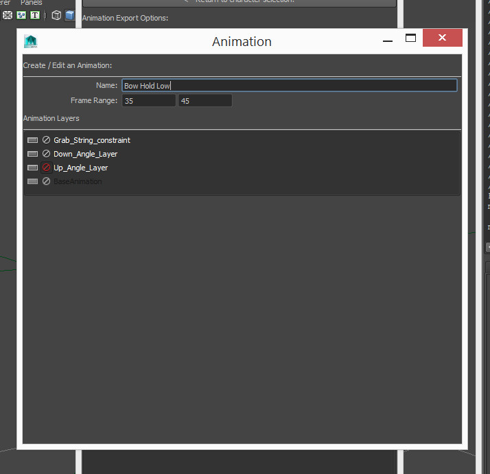

## Game Animation Export

Managing game animations in Maya can be tricky. Especially when those animations are variations on the same thing or have different frame ranges etc.

This tool facilitates easy management of animations and exporting.

To install, download the following file and drag - drop it into Maya's viewport.

__<download>gameAnimExport</download>__

You will get a new shelf icon in whichever shelf is currently active.

* Click the shelf icon. You will get a new window popup.

### Character Selection

* Initially you'll not have any characters. Click the button to create a new one. If you do have a character already you'll see it in the window (pictured). You can have multiple "characters" in a scene. Each will have its own animations and export options.

### Main Window

* __Character Name__: This name will feature in the selection window (above) and will also prefix any animations exported from this window. "CharName@Animation_Name"

* __Add New Animation__: Will prompt you with the animation window (below). Details are filled out on the fly. No need to hit save.

* __Animation Section__: Contains each animation, its frame range and a bunch of convenience buttons. All of which can be moused over for more details. Buttons from left to right:

* Export: Exports the animation singularly.
* Range: Move the timeslider, and turn on/off relevant animation layers to match the animation.
* Edit: Make changes to the animation.
* Trash: Delete the clip.

* __Export All__: Exports every animation in the box above it.

* __Add Selected Objects to Export__: Adds objects selected to the list below. Objects (and their decendants) here will be included in the export. Generally you want to add the skeleton of the rig in this box.

* __Add Folder for Exporting__: Like the objects above, adds a folder to export into. You can add multiple folders if you like and the export will happen into each folder. If a folder can't be found it will be skipped. This means you can share the file and have different paths for different computers if you really wanted to.

### Animation Window

* __Name__: Name of the animation. Seen in the window (above)

* __Frame Range__: Range of the animation. This does _NOT_ need to be same as the full timeline. When exporting animations this range will be made the current range just prior to export. This means you can have multiple animations in the same file and export them all separately.

* __Animation Layers__: Correct combination of animation layers required for this animation clip. You can use animation layers to alter animations and export them as different clips. An example is to have a running character run on a 45 degree angle. Click the mute / Solo buttons here to tell it which layers need to be on / off during export.
