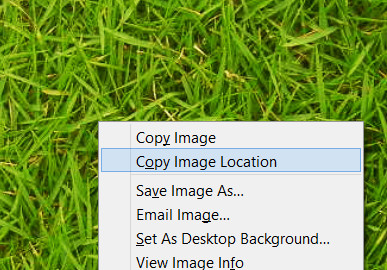

## Remote Textures

When you're quickly roughing something out in Maya it can be beneficial to pop online and find a texture that is somewhat suitable.

Sure downloading the texture and adding it is not hard. But why not make it easier?!

To install the tool download from the link below. Drag and drop the file into the Maya viewport.

__<download>remote_texture</download>__

The tool will sit happily running in the background.

To use the tool:

* Go online and find the image you want to use.
* Open the image in the browser and copy the link. This means linking to the image itself and not the google search results. Links ending in ".jpg" ".png" etc are good candidates.
* Create or Edit a materials texture. Where you would put the path to the file, instead paste the web link.

__Tip:__

* A good way to get the image link is to right click the image and "copy location"

* If you open the script editor, you can watch the progress of the download.

* You need to have saved the scene in order for the download to happen. The files are saved in the same folder as the scene, and without a saved file we have nowhere to put them.
