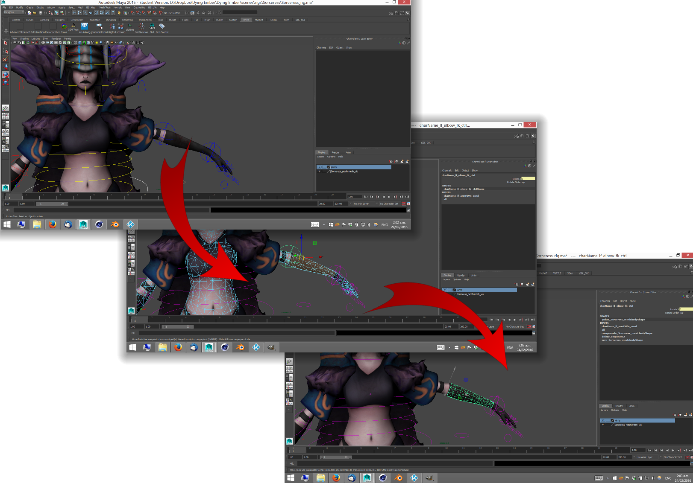

## Shape Control

> Sometimes rigs get a bit overloaded with controllers. Nurbs curves here and there hiding what is important. The performance. It would be nice to just click somewhere on the mesh and control that section.

### To Use

* Copy the code below into a shelf button.
* Select the faces on your rigs mesh that will become the controller shape (see above). For instance, an arm control would affect that portion of the arm.
* Select also the controller you wish to use.
* Click the shelf icon.


# Use geometry as a Rig Controller.
# Created By Jason Dixon. http://internetimagery.com
#
# Usage: Add code below to a shelf button. Select some polygon faces, and a controller object. Hit the button!
#
# This program is free software: you can redistribute it and/or modify
# it under the terms of the GNU General Public License as published by
# the Free Software Foundation, either version 3 of the License, or
# any later version.
#
# This program is distributed in the hope that it will be useful,
# but WITHOUT ANY WARRANTY; without even the implied warranty of
# MERCHANTABILITY or FITNESS FOR A PARTICULAR PURPOSE.  See the
# GNU General Public License for more details.

import maya.cmds as cmds
import collections
import functools

def unique_name(name):
    working = name
    i = 0
    while cmds.objExists(working):
        i += 1
        working = "%s_%s" % (name, i)
    return working

def main():
    try:
        control = cmds.ls(sl=True, type="transform")
        if len(control) != 1:
            return cmds.warning("Please select a single controller.")
        control = control[0]
        faces = cmds.polyListComponentConversion(cmds.ls(sl=True, type="float3"), tf=True, internal=True)
        if not faces:
            return cmds.warning("Please select a controller and some faces.")
    except RuntimeError:
        return cmds.warning("Please select a controller and some faces.")

    err = cmds.undoInfo(openChunk=True)
    connect = functools.partial(cmds.connectAttr, f=True)
    try:
        # Clear out existing shapes
        control_shapes = cmds.listRelatives(control, c=True, s=True)
        if control_shapes:
            cmds.delete(control_shapes)

        # Map transform to shapes
        mesh_map = collections.defaultdict(list) # Map meshes to faces
        object_map = collections.defaultdict(set) # Map transforms to meshes
        for face in faces:
            mesh = cmds.listRelatives(face, p=True)[0]
            xform = cmds.listRelatives(mesh, p=True)[0]
            mesh_map[mesh].append(face)
            object_map[xform].add(mesh)

        # Create a new mesh and link it to the selected mesh
        for xform, meshes in object_map.iteritems():
            for mesh in meshes:
                new_mesh = cmds.createNode("mesh", n=unique_name("picker_%s" % mesh), p=control, ss=True)
                connect("%s.outMesh" % mesh, "%s.inMesh" % new_mesh)

                # Clear out unneeded faces
                cmds.select([new_mesh + "." + a.split(".")[-1] for a in mesh_map[mesh]], r=True)
                cmds.select("%s.f[:]" % new_mesh, tgl=True)
                cmds.delete()

                # Find Delete node we just created
                delete_node = cmds.listConnections("%s.inMesh" % new_mesh, type="deleteComponent")
                if not delete_node:
                    raise RuntimeError("Deletion Node not found")
                delete_node = delete_node[0]

                # Drop in between Delete node and our Mesh
                geo_xform = cmds.createNode("transformGeometry", n=unique_name("compensate_%s" % mesh), ss=True)
                connect("%s.outputGeometry" % delete_node, "%s.inputGeometry" % geo_xform)
                connect("%s.outputGeometry" % geo_xform, "%s.inMesh" % new_mesh)

                # Zero out any mesh movement
                matrix_multi = cmds.shadingNode("multMatrix", asUtility=True, n=unique_name("zero_%s" % mesh))
                connect("%s.worldMatrix[0]" % xform, "%s.matrixIn[0]" % matrix_multi)
                connect("%s.worldInverseMatrix[0]" % control, "%s.matrixIn[1]" % matrix_multi)
                connect("%s.matrixSum" % matrix_multi, "%s.transform" % geo_xform)

                # Pretify the mesh
                cmds.setAttr("%s.displayBorders" % new_mesh, 1)
                cmds.setAttr("%s.displayEdges" % new_mesh, 1)
                cmds.setAttr("%s.castsShadows" % new_mesh, 0)
                cmds.setAttr("%s.receiveShadows" % new_mesh, 0)
                cmds.setAttr("%s.motionBlur" % new_mesh, 0)
                cmds.setAttr("%s.primaryVisibility" % new_mesh, 0)
                cmds.setAttr("%s.smoothShading" % new_mesh, 0)
                cmds.setAttr("%s.visibleInReflections" % new_mesh, 0)
                cmds.setAttr("%s.visibleInRefractions" % new_mesh, 0)
                cmds.setAttr("%s.doubleSided" % new_mesh, 0)

                # Vanish!
                mat = "invsible_material"
                if not cmds.objExists(mat):
                    mat = cmds.shadingNode("surfaceShader", asShader=True, n=mat)
                    mat_set = cmds.sets(r=True, nss=True, em=True, n=unique_name("%sSG" % mat))
                    cmds.connectAttr("%s.outColor" % mat, "%s.surfaceShader" % mat_set)
                    cmds.setAttr("%s.outTransparency" % mat, 1, 1, 1, type="double3")
                else:
                    mat_set = "%sSG" % mat
                cmds.sets(control, e=True, fe=mat_set)
        cmds.select(control, r=True)
    except Exception as err:
        raise
    finally:
        cmds.undoInfo(closeChunk=True)
        if err:
            cmds.undo()

main()

