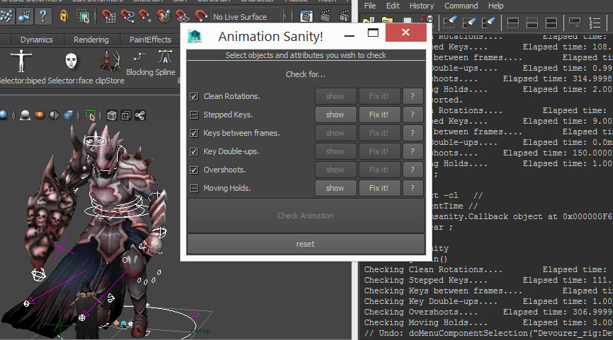

## Anim Health Check

Animation is complicated. So many factors rely on other factors, and it can be tricky to keep on top of it all.

Computers are no good at acting (which is a good thing! Job securtiy!) so they cannot animate for us. However there are a few little repetitive tasks cleaning animation curves that can be computerized!

This tool attempts to address some of them. Allowing you to focus on the performance and keep your sanity!

To install the tool download from the link below. Drag and drop the file into the Maya viewport.

__<download>anim_health_check</download>__

You will get a new shelf icon in whichever shelf is currently active.

####To use the tool:

* Click the shelf icon. You will get a new window popup.
* Select the controllers / objects you wish to check.
* Click the "Check Animation" button. You will get the results updated (as above).
* Click any of the "show" buttons to highlight the affected keyframes in the graph editor (make sure you have it open). This lets you make an informed decision on how to proceed.
* Click the "fix it" button to allow the tool to fix the issue for you. The tool does its absolute best to preserve your animation as it is. However if in doubt, simply hit "show" to get the keys and fix them manually.

####Tips:

* The tool only checks keyframes that fall within the current timeslider range. If you want to check your entire animation be sure to open the time slider up to the full duration. Conversely if you want to limit the checking to only a portion of the animation you can close up the timeslider to only that range.
* Additionally if you shift-drag in the timeslider to create a selection (looks like a red bar), the tool will only look in that selection.
* If you wish to narrow the checking further, to specific channels you can do that too. Either highlight them in the channelbox or in the graph editor (on the left side) to limit the checking to only those channels.
