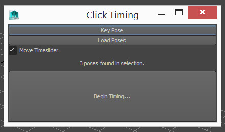

## Clicktime

Timing in animation can be too mechanical at times. Sometimes it's nice to be able to time out things more organically. This script facilitates that.

To install, download the following file and drag - drop it into Maya's viewport.

__<download>clicktime</download>__

You will get a new shelf icon in whichever shelf is currently active.

To use the tool:

* Click the shelf icon. You will get a new window popup.
* Select the controllers / objects you wish to time.
* Click "Load poses" to load up some poses
* Click begin timing to start the clock!
* Click once for each pose after the desired time.

__TIPS:__

* Poses are considered to be a point in time with a keyframe on each and every frame. Such as is created commonly when blocking.
* If you select attributes in the channelbox or graph editor, the timing will be restricted to those attributes.
* Ditto for selecting keyframes in the graph editor.
