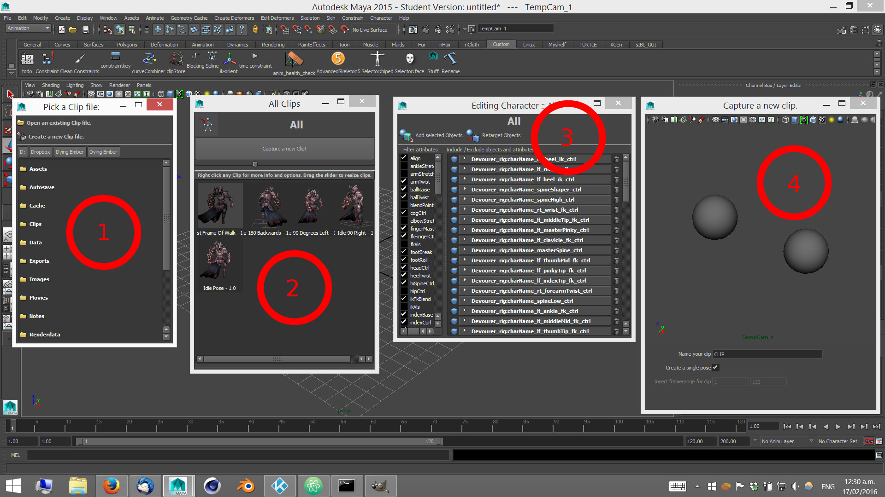

## Clip Store

Pose Libraries are nothing new. There are a few floating around and yet they miss a few fundamental things.

1) They are explicit with the objects and controllers they work on (one tool per rig)

2) They store only singular poses. One frame.

This tool addresses those two factors by allowing retargeting of poses to different similar rigs, and by treating "poses" as single frame animations. Storing animations of arbitrary length.

Lets get into it! :)

__<download>clipstore</download>__

You will get a new shelf icon in whichever shelf is currently active.

#### Figure 1

To start, click the shelf icon. You'll get this browser window. This file contains all poses relating to the objects that are bound (more info below).

Click a file to load it up, or click "Create a new clip file" to build a new one.

#### Figure 2

Here we have the main window. All clips reside here. Clicking any of the icons in the main area will pose the character on that current frame to match the pose saved.

If you've just made a new clip file. This will be empty __and you will need to bind some objects.__ More info below.

You can right click any of the pose icons for more options and to delete any of them.

Click the "Capture a new clip" button to create a new clip.

Click the little blue rig icon in the top left corner to bring modify the bound objects.

#### Figure 3

This window displays all objects / controllers etc that are bound to the pose file. Select all the objects you wish to use in the pose and click "Add Selected Objects".

Clip files work on an object selection bases. In other words, if you were creating some hand poses, you would select all the hand controls in here and add them. Then you would put all the hand poses in this file. If you then wanted to make some facial poses, you would do that in another clip file.

You can untick or trash objects and attributes you do not wish to be used in here. Make sure you have something in here though, or there will be nothing to pose!

To retarget these objects to another rig, click the "Retarget Objects" button.

#### Figure 4

Create a new clip window!

The main window at the top is a live camera. So frame up your model nicely. :)

Type in a name for the desired pose / clip in the box below and untick the checkbox if you wish to save more than one frame of animation.

Once all this is done, to store the clip simply close the window.
