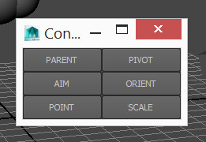

## Constraint Key

Ah constraints. They are useful. Oh so useful, and oh how frustrating they are.

Sometimes you need a really quick way to stick one object to another for a few frames. Setting up a full constraint for this task is complete overkill. This is the purpose of the tool below!

To install, download the following file and drag - drop it into Maya's viewport.

__<download>constraintkey</download>__

You will get a new shelf icon in whichever shelf is currently active.

To use the tool:

* Click the shelf icon. You will get a new window popup.
* Select one or two objects.
* (Optional) Select a range in the timeslider to limit the keying to that range.
* Press the button of the constraint you want.

__TIPS:__

* Select the driver first, then the driven object. Just like normal constraints
* Selecting one object only will constrain it to the "world". This means it will be kept stationary. This is useful if it is in a parented hierarchy and you want it to stay still.
