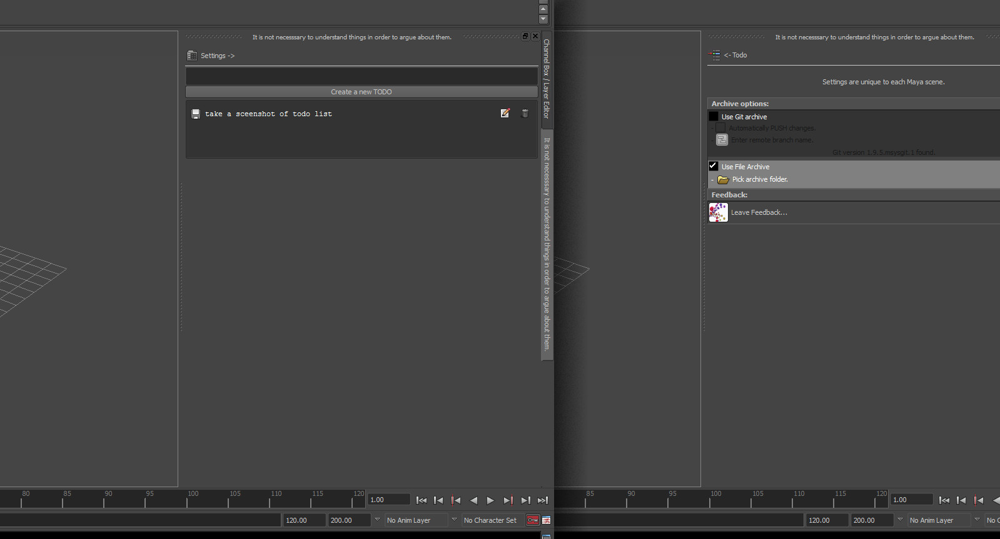

## Todo

Todo lists need no introduction. They're everywhere, and yet here is another!

This tool makes it easy to keep track of tasks, or to give tasks to others. Tasks are saved in the scene file, so as to be retrieved contextually.
There are a couple of other nifty features also. So read on!

__<download>todo</download>__

You will get a new shelf icon in whichever shelf is currently active.

* Type a task into the box and click "Create TODO".

* Click the text of the todo (or the little save icon next to it) to complete the task.

* Click the edit icon to make changes to the task name.

* Click the trash icon to remove the task without marking it as complete.

Thats it. Todo lists are pretty simple and straight forward. Of course that is great and all. But it's nothing you cannot do easily on a piece of paper. So lets throw in some more functionality.

### Archives

The Todo tool supports simple archiving of your files upon todo completion. This has many advantages over simple incremental saving.

* Click the "Settings" button to bring up the settings menu. __Settings are saved on a per-scene basis. A new scene will need settings set up again.__

* Click any of the options presented to activate that form of archive. Various different archive options will appear if they are found to exist on your computer (GIT for instance).

* Add in any extra information to complete the archive settings. For instance, with "File Archive" you must pick a folder to save off the scene files. This folder will store incremental saves as you tick off more and more tasks.

* If you must restore an old file. You can simply take it and replace your current file. The files are named with the task that spawned them prominent in the file, and when opened a helpful reminder message will appear to get you up to speed.

This is a great way of working. It keeps you from losing your work!

### BUT WAIT! There is more!

Here are some more helpful features you can activate in the naming of your tasks!

* If you have a saved scene (ie not "untitled") marking off a todo will prompt you to save. Convenient since you just achieved a milestone. Never forget to save again!

* You can group tasks by adding hashtags in the name. For instance a task containing "#blocking" will be moved into a group named blocking. Tasks can span multiple groups.

* Tasks containing frame numbers will prompt a helper button that takes you to that frame number.

* Tasks that contain a frame range (ie 40 to 500, 2-54 etc) will provide a helper button that resizes the timeline to that range.

* Tasks that contain web urls will contain a helper button that opens the webpage in a browser.

* Tasks that contain an absolute file path, or a relative (from the current file) path to another file will prompt a helper button that loads the file up. If it is another Maya file, it will be opened in the current instance of Maya.
