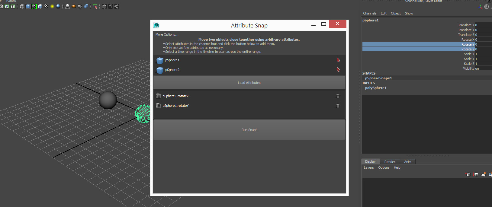

## Todo

Sticking one object to another is exceedingly common in animation. Be it a glass to a hand holding it, or a hat to someones head.

Generally a constraint built into Maya will do the job, no problem. Great! Use it! :P

However there are the odd times where a constraint does not work. Typically those situations come about because you're forced to work in with a custom attribute. Such as a finger-curl or foot-roll. In these situations you can use Attribute Snap to lock the animation in the right place!

__<download>attrsnap</download>__

You will get a new shelf icon in whichever shelf is currently active.

* Select two objects. The goal is to bring those objects as close as possible together. Sometimes you can parent a locator to something to get the correct offset.

* Click the shelf icon.

* Select the attributes you wish to use in the channelbox. Click "Load attributes".

* (Optional) Highlight a section of the timeline to run the scan across that entire time range.

* Click, "Run Snap!".
