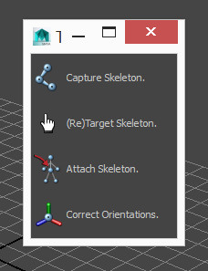
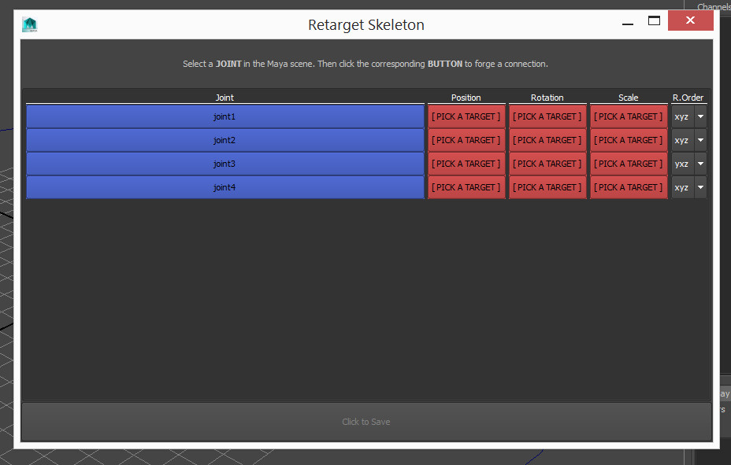
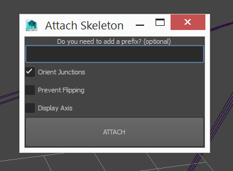
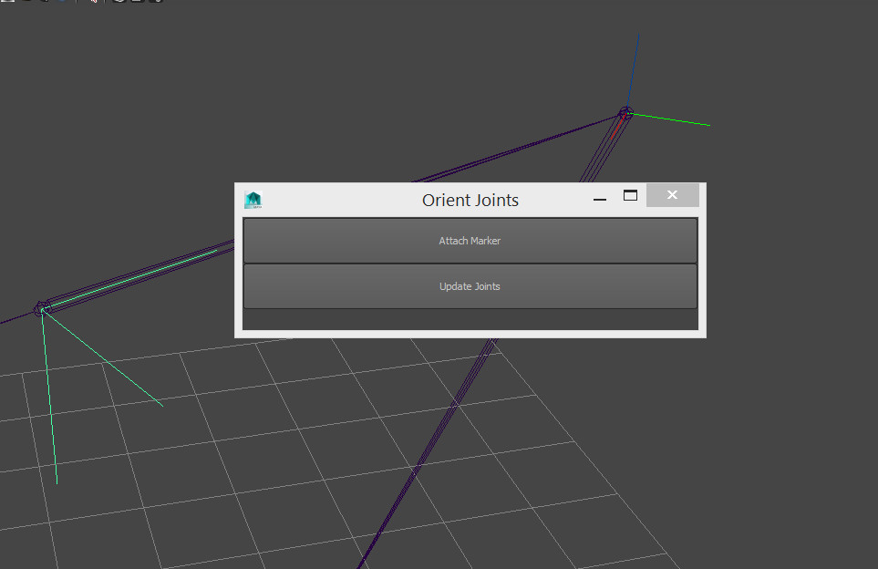

## Twin Skeleton

When dealing with rigging in games, you are very limited in what you can export out of Maya. The easiest and most reliable way to export on any platform is to use the most basic element availible. Joints, Meshes and Skinning.

A popular technique to achieve this is to continue with the advanced rig (that contains things you cannot export) for the purposes of animating with all the bells and whistles.
Then attaching that rig to another rig that contains nothing but simple joints.

This is what this tool facilitates.

To install, download the following file and drag - drop it into Maya's viewport.

__<download>twinSkeleton</download>__

You will get a new shelf icon in whichever shelf is currently active.

The tool is divided into four parts. Documented below:

### Capture Skeleton

This is your first port of call.

Create your first skeleton in Maya. Draw out the joints and build it up.
The most important thing at this stage is to ensure your joint hierarchy (if you need a root bone on the floor, be sure to include it etc) and joint naming is spot on!

The reason for this step is this skeleton will become reusable.

Select any joint in the skeleton and click the button to save it off. If you don't select the root, the tool will find the root for you, so don't worry.

Now onto step two...

### (Re)Target Skeleton

This is where the skeleton file (created in the previous step) comes into play. Currently it contains only information about the joints. Now we want to add information about where the joints should be attached.

If you haven't already, build your advanced rig.

Now select the option "Retarget skeleton" in the menu and open a skeleton file.

For each joint (in blue) select the corresponding joint / object / control on the advanced rig in the viewport. This is what the final skeleton will be attached to.

You can either click the red buttons individually to attach position rotation and scale (you can be positioned at one point and rotate based on another if you wish), or click the blue joint button as a shortcut to select all three.

Once you have targeted all the bones in your skeleton, save the file again. This saves another skeleton file, that is the same as the previous file, only now with target information too.
You can safely save this file over the old one if you wish, or if targeting a new rig, name it whatever you want.

### Attach Skeleton

Now finally we get to attach the skeleton. Thankfully after all the setup this step is simple, and that's the point of all this.

Click the button and select a skeleton file you wish to build. The tool will read the attachments supplied earlier from the file and attempt to build a skeleton on each of them.

Assuming your advanced rig maintains its naming scheme. This step from here on is a two second process. Building endless rigs so long as the setup remains the same.

* __Prefix__ : Should you choose, you can type something in here. This will prefix all joints with whatever is written. This can be useful if building the same skeleton more than once in the same file.

* __Orient Junctions__ : If the joint has multiple children, there are many possible directions it could point. Leaving this ticked allows the tool to make its best guess. Unticking leaves the joint oriented to the world.

* __Prevent Flipping__ : If this is on, the tool will ensure that limbs of different direction (like the spines "S" curve) don't have joints flipping 180 degrees halfway through. This is useful if you are planning on animating the joints directly. Otherwise this is typically not needed.

* __Display Axis__ : Ticking this will turn on the Axis display for the joints so their rotations can be easily inspected. Correct joint rotation is vital, especially if retargeting animations across different rig setups.

### Correct Orientations

The tool is pretty good at figuring out correct rotations. But as is always the case, you may want something different to what it gives you.

Click the button to bring up the following menu:

* Select each joint you wish to move or reorient, and press the "Attach Marker" button.
* A marker will appear on each joint (visible in the screenshot above as the highlighted lines on the left, and the coloured ones on the top right. Attached to the joint).
* Move and rotate the markers to the desired locations and orientations.
* Press the "Update Joints" button to update all joints to their corresponding markers positions.

__TIP:__

You can update joints position / orientation after the rig has been built, constrained and skinned too. The skin and constraints will be altered to reflect the new joint positions. Nifty!

* Select one or two objects.
* (Optional) Select a range in the timeslider to limit the keying to that range.
* Press the button of the constraint you want.

__TIPS:__

* Select the driver first, then the driven object. Just like normal constraints
* Selecting one object only will constrain it to the "world". This means it will be kept stationary. This is useful if it is in a parented hierarchy and you want it to stay still.
