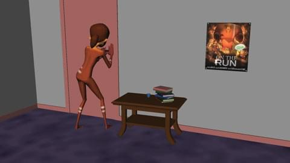
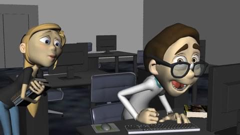

<iframe src="https://player.vimeo.com/video/131877881" width="500" height="281" frameborder="0" webkitallowfullscreen mozallowfullscreen allowfullscreen></iframe>

      
    <a href="{{ "/reel/cv" | prepend: site.baseurl }}"><i class="fa fa-book"></i> Curriculum Vitae</a> 
    I'm always on the lookout for more opportunities. Need to bring a little life to your project? Please, get in touch. 
    <i class="fa fa-smile-o"></i>

### Shot Breakdowns

<ol class="reelshots">
    <li>
        
        
Mother attempts to cheer up her sad daughter. Responsible for all animation.

    </li>
    
    <li>
        
        
Soldier comes home from war. Noises bring back memories... Responsible for all animation.

    </li>
    
    <li>
        
        
Girl getting chased, frantically tries to halt her pursuer. Responsible for all animation.

    </li>
    
    <li>
        
        
Part of a greater set of challenges, a couple of creatures use teamwork to scale a cliff. Responsible for all animation.

    </li>
    
    <li>
        
        
A couple dog cycles. Walk and Trot. Responsible for all animation.

    </li>
    
    <li>
        
        
Nerdy guy gets caught mentally preparing to propose to a co-worker. Responsible for all animation.

    </li>
</ol>
 
